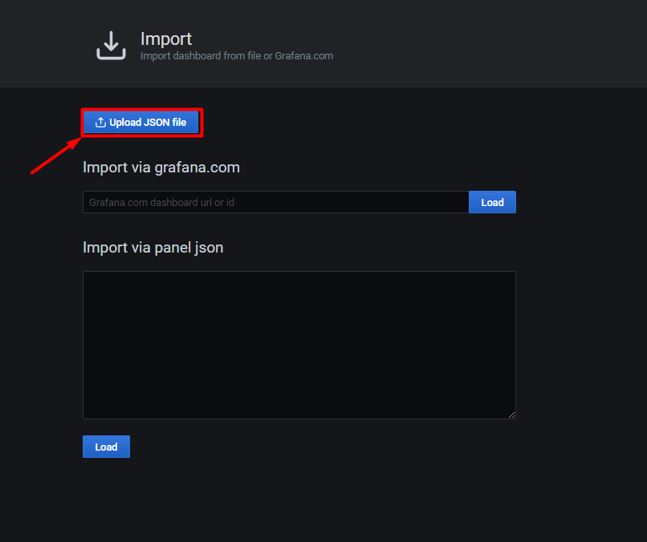

# Import dashboard của iDRAC lên Grafana

Hướng dẫn này mình sử dụng template có sẵn của grafana để hiển thị lên dashboard monitor iDRAC.

Để bắt đầu, trước tiên bạn phải down file json template cho iDRAC [tại đây](https://raw.githubusercontent.com/hungviet99/Tim-hieu-Prometheus/master/docs/Prometheus_HungNV/Exporter_Dashboard_Json/iDRAC_Dell_server.json) hoặc truy cập vào link sau: https://bom.to/HCpIQQ3pizdNS

Sau khi tải về file json, tiến hành truy cập grafana.

- Tại giao diện `Home` của grafana, chọn `+` sau đó chọn `import` để tải lên file json.

- Chọn `Upload JSON file` để tải lên file json

- Chọn file json mới tải xuống ở bước trước để up lên và chọn `Import` để nhập

- Sau khi import, dashboard có thể hiển thị dữ liệu monitor iDRAC như này là đã thành công. 

- Chọn `Save` để lưu lại dashboard

