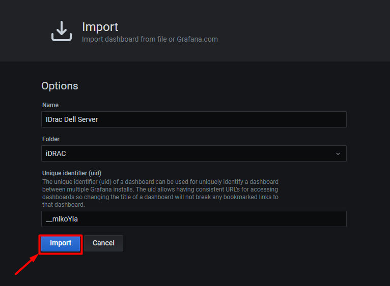

# Import dashboard cho SNMP Exporter

## 1. Import dashboard của iDRAC lên Grafana

Hướng dẫn này mình sử dụng template có sẵn của grafana để hiển thị lên dashboard monitor iDRAC.

Để bắt đầu, trước tiên bạn phải down file json template cho iDRAC [tại đây](./Exporter_Dashboard_Json/iDRAC_Dell_server.json)

Sau khi tải về file json, tiến hành truy cập grafana.

- Tại giao diện `Home` của grafana, chọn `+` sau đó chọn `import` để tải lên file json.

- Chọn `Upload JSON file` để tải lên file json

- Chọn file json mới tải xuống ở bước trước để up lên và chọn `Import` để nhập

- Sau khi import, dashboard có thể hiển thị dữ liệu monitor iDRAC như này là đã thành công. 

- Chọn `Save` để lưu lại dashboard

## 2. Import json để tạo dashboard SNMP cho switch

Hướng dẫn này mình sử dụng template có sẵn của grafana để hiển thị lên dashboard monitor Switch.

### 2.1. Import dashboard tổng quan

Down file json template cho Switch [tại đây](./Exporter_Dashboard_Json/SNMP_Switch_Stats.json)

Sau khi tải về file json, tiến hành truy cập grafana.

- Tại giao diện `Home` của grafana, chọn `+` sau đó chọn `import` để tải lên file json.

- Chọn `Upload JSON file` để tải lên file json

- Chọn file json mới tải xuống ở bước trước để up lên và chọn `Import` để nhập

- Sau khi import, dashboard có thể hiển thị dữ liệu monitor switch như này là đã thành công. 

- Chọn `Save` để lưu lại dashboard

### 2.2. Import dashboard monitor interface

Down file json template cho Interface của Switch [tại đây](./Exporter_Dashboard_Json/SNMP_Interface_detail.json)

Sau khi tải về file json, tiến hành truy cập grafana.

- Tại giao diện `Home` của grafana, chọn `+` sau đó chọn `import` để tải lên file json.

- Chọn `Upload JSON file` để tải lên file json

- Chọn file json mới tải xuống ở bước trước để up lên và chọn `Import` để nhập

- Sau khi import, dashboard có thể hiển thị dữ liệu monitor interface của thiết bị như này là đã thành công. 

- Chọn `Save` để lưu lại dashboard

