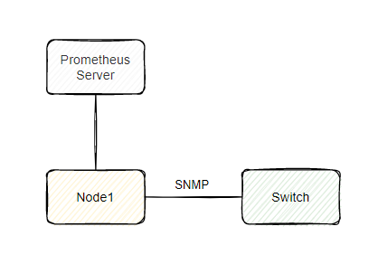
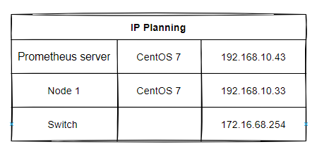
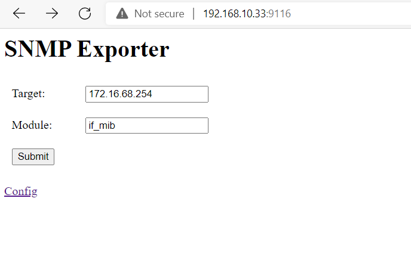
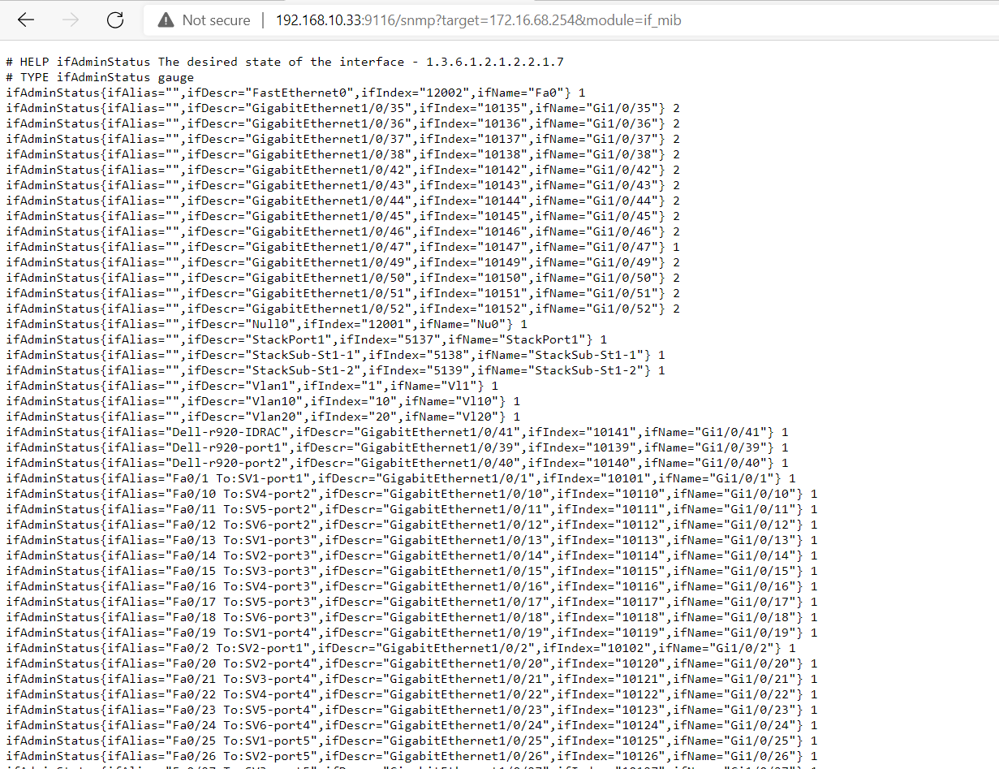
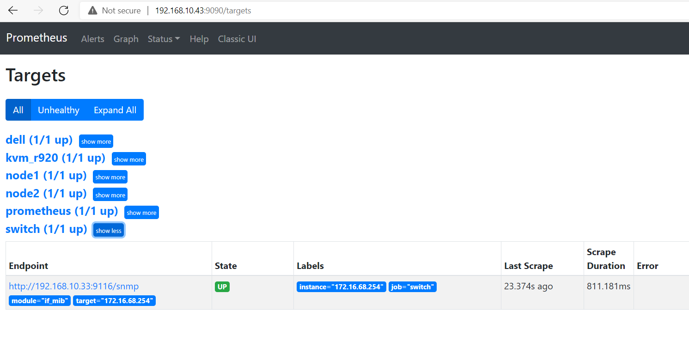

# Cài đặt SNMP Exporter giám sát Switch trên CentOS 7

## 1. Mô hình 

### Mô hình triển khai 



### IP planning 



### Kịch bản chi tiết

- Switch được manage qua ip `172.16.68.254`

- Dải mạng của `Node 1` được route tới dải mạng của IP manage Switch.

- Node 1 sử dụng giao thức SNMP để truy cập và lấy thông tin của Switch thông qua IP `172.16.68.254` sau đó export ra dữ liệu ra port 9116.

- Prometheus server truy cập vào để lấy thông tin Switch từ node 1 qua port 9116.

## 2. Thiết lập môi trường

### 2.1. Thiết lập mỗi trường cho Switch

- SSH hoặc telnet vào switch theo địa chỉ `172.16.68.254`

- Truy cập vào `config terminal`

```
Switch>en
Password:
Switch#configure terminal
Enter configuration commands, one per line.  End with CNTL/Z.
```

- Cấu hình SNMP

```
snmp-server community public ro
snmp-server enable traps snmp
snmp-server host 192.168.10.33 version 2c public udp-port 162
exit
```
> Lưu ý: Thay ip bằng ip của node 1

- Lưu lại cấu hình sau đó kiểm tra với lệnh `show snmp`

```
Switch#show snmp
Chassis: FOC1644Z3ZK
101 SNMP packets input
    0 Bad SNMP version errors
    101 Unknown community name
    0 Illegal operation for community name supplied
    0 Encoding errors
    0 Number of requested variables
    0 Number of altered variables
    0 Get-request PDUs
    0 Get-next PDUs
    0 Set-request PDUs
    0 Input queue packet drops (Maximum queue size 1000)
1 SNMP packets output
    0 Too big errors (Maximum packet size 1500)
    0 No such name errors
    0 Bad values errors
    0 General errors
    0 Response PDUs
    1 Trap PDUs
SNMP global trap: enabled

SNMP logging: enabled
    Logging to 192.168.10.33.162, 0/10, 0 sent, 0 dropped.
SNMP agent enabled
```

Ta thấy đã có cấu hình enable cho ip `192.168.10.33`

### 2.2. Thiết lập môi trường cho Node 1

- Nếu bạn đã [cài đặt SNMP monitor iDRAC](./6._Install_SNMP_monitor_iDRAC.md) theo hướng dẫn ở bài trước của mình và exporter cho switch này được cài đặt trên cùng 1 node với exporter iDRAC thì có thể bỏ qua bước này và thực hiện luôn bước [Cấu hình Exporter trên Prometheus server](#prom)

- Update hệ thống

```
yum update -y
```
 
- Tắt firewall và selinux

```
systemctl  disable firewalld --now
```

```
sed -i 's/SELINUX=enforcing/SELINUX=disabled/g' /etc/sysconfig/selinux
sed -i 's/SELINUX=enforcing/SELINUX=disabled/g' /etc/selinux/config
setenforce 0
```

- Đồng bộ thời gian với NTP server

Kiểm tra thời gian hệ thống, nếu thời gian sai hãy đặt lại thời gian hoặc đồng bộ thời gian với NTP server.

Cú pháp đặt lại thời gian trên linux:

```
date -s "09 JUN 2021 08:52:00"
```

Kiểm tra thời gian:

```
[root@exporter ~]# date
Wed Jun  9 08:53:17 +07 2021
```

## 3. Cài đặt SNMP Exporter

*Thực hiện trên Node 1*

### 3.1. Tải về SNMP Exporter

-  Cài đặt các gói cần thiết

```
yum install -y wget
```

- Tạo user cho node exporter

```
useradd --no-create-home --shell /bin/false snmp_exporter
```

- Tải về và giải nén source code

```
cd /opt

wget https://raw.githubusercontent.com/hungviet99/Tim-hieu-Prometheus/master/docs/Prometheus_HungNV/SNMP_Exporter/snmp.yml

wget https://github.com/prometheus/snmp_exporter/releases/download/v0.19.0/snmp_exporter-0.19.0.linux-amd64.tar.gz

tar xzf snmp_exporter-0.19.0.linux-amd64.tar.gz
```

- Di chuyển source code và cấp quyền cho user đã tạo ở trên

```
cp /opt/snmp.yml /usr/local/bin/snmp.yml
cd snmp_exporter-0.19.0.linux-amd64
cp ./snmp_exporter /usr/local/bin/snmp_exporter
chown snmp_exporter:snmp_exporter /usr/local/bin/snmp.yml
chown snmp_exporter:snmp_exporter /usr/local/bin/snmp_exporter
```

- Tạo systemd cho exporter

```
cat <<EOF >  /etc/systemd/system/snmp_exporter.service
[Unit]
Description=Prometheus SNMP Exporter Service
After=network.target

[Service]
Type=simple
User=snmp_exporter
WorkingDirectory=/usr/local/bin/
ExecStart=/usr/local/bin/snmp_exporter

[Install]
WantedBy=multi-user.target
EOF
```

- Khởi động dịch vụ `snmp_exporter`

```
systemctl daemon-reload
systemctl start snmp_exporter
systemctl enable snmp_exporter
```

- Truy cập web với địa chỉ url `http://192.168.10.33:9116`, nhập vào target là ip truy cập Switch, Module là if_mib.



Chọn `Submit` ta sẽ thấy các metric lấy được như sau:



<a name="prom"></a>
#### 3.2.2. Cấu hình Exporter trên Prometheus server

*Thực hiện trên Prometheus server*

- Thêm cấu hình node exporter vào prometheus server

Tiến hành sửa file `/etc/prometheus/prometheus.yml` thêm nội dung sau:

```
- job_name: 'switch'
  static_configs:
    - targets:
      - 172.16.68.254
  metrics_path: /snmp
  params:
    module: [if_mib]
  relabel_configs:
    - source_labels: [__address__]
      target_label: __param_target
    - source_labels: [__param_target]
      target_label: instance
    - target_label: __address__
      replacement: 192.168.10.33:9116
```

Với `targets` là ip truy cập Switch, `replacement` là địa chỉ và port của máy cài SNMP Exporter.

Sau khi thêm cấu hình trông như sau:

```
global:
  scrape_interval: 15s

scrape_configs:
  - job_name: 'prometheus'
    scrape_interval: 5s
    static_configs:
      - targets: ['localhost:9090']
  - job_name: 'node1'
    scrape_interval: 5s
    static_configs:
      - targets: ['192.168.10.33:9100']
  - job_name: 'kvm_r920'
    scrape_interval: 5s
    static_configs:
      - targets: ['192.168.10.18:9100']
  - job_name: 'dell'
    scrape_interval: 180s
    scrape_timeout: 180s
    static_configs:
      - targets:
          - 10.10.20.18
        labels:
          adGroup: 'ai-bp'
          adUser: '12455'
    metrics_path: /snmp
    params:
      module: [dell]
    relabel_configs:
      - source_labels: [__address__]
        target_label: __param_target
      - source_labels: [__param_target]
        target_label: instance
      - target_label: __address__
        replacement: 192.168.10.33:9116
  - job_name: 'switch'
    static_configs:
      - targets:
        - 172.16.68.254
    metrics_path: /snmp
    params:
      module: [if_mib]
    relabel_configs:
      - source_labels: [__address__]
        target_label: __param_target
      - source_labels: [__param_target]
        target_label: instance
      - target_label: __address__
        replacement: 192.168.10.33:9116
```

- Khởi động lại Prometheus:

```
systemctl restart prometheus
systemctl status prometheus
```

- Truy cập `Status` -> `Targets` ta thấy node up tức là đã thành công.



## Tài liệu tham khảo 

https://www.programmersought.com/article/25824180710/

https://github.com/urosorozel/snmp_monitoring