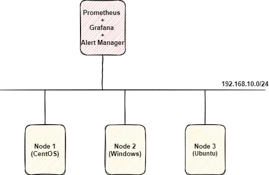

# Cài đặt libvirt exporter monitor KVM

## 1. Mô hình 

Ở bài trước ta đã cấu hình node exporter cho node3 (ubuntu). Vì node 3 đồng thời chạy KVM nên ta sẽ tiến hành cấu hình thêm libvirt exporter trên node 3 để thông qua libvirt monitor các VM trong KVM.

### Mô hình triển khai 



### IP planning 


## 2. Thiết lập môi trường

- Update hệ thống

```
apt update -y
```
 
- Tắt firewall (nếu firewall được bật thì phải tiến hành mở port 9100)

```
systemctl  disable ufw --now
```

- Đồng bộ thời gian với NTP server

Kiểm tra thời gian hệ thống, nếu thời gian sai hãy đặt lại thời gian hoặc đồng bộ thời gian với NTP server.

Cú pháp đặt lại thời gian trên linux:

```
date -s "09 JUN 2021 08:52:00"
```

Kiểm tra thời gian:

```
[root@kvm ~]# date
Wed Jun  9 08:53:17 +07 2021
```

## 3. Cài đặt Libvirt Exporter

*Thực hiện trên kvm*

### 3.1. Cài đặt Docker

- Tải về docker 

```
apt install docker.io -y
```

-  Khởi động docker

```
systemctl start docker
systemctl enable docker
systemctl status docker
```

### 3.2. Cài đặt Libvirt Exporter

- Clone repo libvirt exporter

```
cd /opt/
git clone https://github.com/hungviet99/libvirt-exporter.git
cd libvirt-exporter/
docker image build -t libvirt_exporter:latest .
```

- Chạy lệnh sau để run libvirt exporter

```
docker run -d \
--name libvirt_exporter \
-p9177:9177 \
--pid="host" \
--restart always \
-v "/var/run/libvirt:/var/run/libvirt" \
libvirt_exporter:latest
```

- Kiểm tra container mới tạo

```
[root@kvm ~]# docker container ls -a
CONTAINER ID        IMAGE                     COMMAND                CREATED             STATUS              PORTS                    NAMES
6bb15bdd5afd        libvirt_exporter:latest   "./libvirt-exporter"   11 hours ago        Up 11 hours         0.0.0.0:9177->9177/tcp   libvirt_exporter
```

- Truy cập trình duyệt với url `http://192.168.10.18:9100/metrics` để kiểm tra


### 3.3. Cấu hình Libvirt Exporter trên Prometheus server

*Thực hiện trên Prometheus server*

- Thêm cấu hình libvirt exporter vào prometheus server

Tiến hành sửa file `/var/lib/docker/volumes/prometheus_config/_data` thêm nội dung sau:

```
- job_name: 'libvirt_kvm'
  scrape_interval: 15s
  static_configs:
    - targets: ['192.168.10.18:9177']
```

Sau khi thêm cấu hình sẽ như sau:

```
global:
alerting:
  alertmanagers:
  - static_configs:
    - targets:
rule_files:
scrape_configs:
  - job_name: 'prometheus'
    static_configs:
    - targets: ['localhost:9090']
  - job_name: 'node1'
    scrape_interval: 5s
    static_configs:
      - targets: ['192.168.10.33:9100']
  - job_name: 'node2'
    scrape_interval: 5s
    static_configs:
      - targets: ['192.168.10.23:9182']
  - job_name: 'node3'
    scrape_interval: 5s
    static_configs:
      - targets: ['192.168.10.18:9100']
  - job_name: 'libvirt_kvm'
    scrape_interval: 15s
    static_configs:
      - targets: ['192.168.10.18:9177']
```

- Khởi động lại container chạy prometheus 

```
docker container restart prometheus
```

**Tài liệu tham khảo:**

https://github.com/AlexZzz/libvirt-exporter