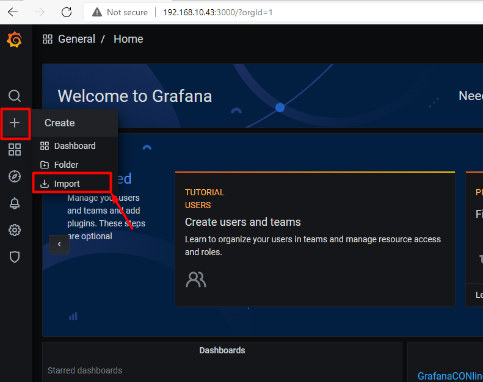
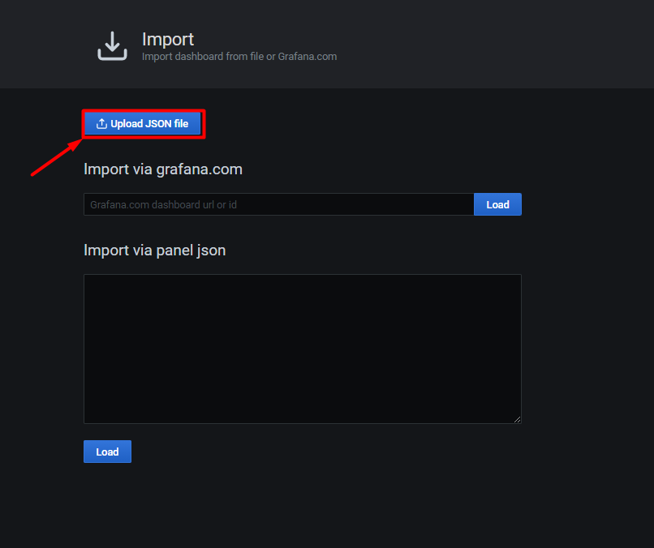
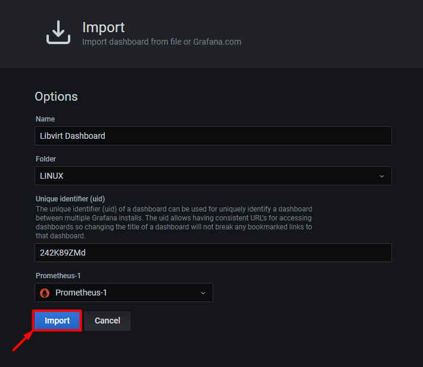
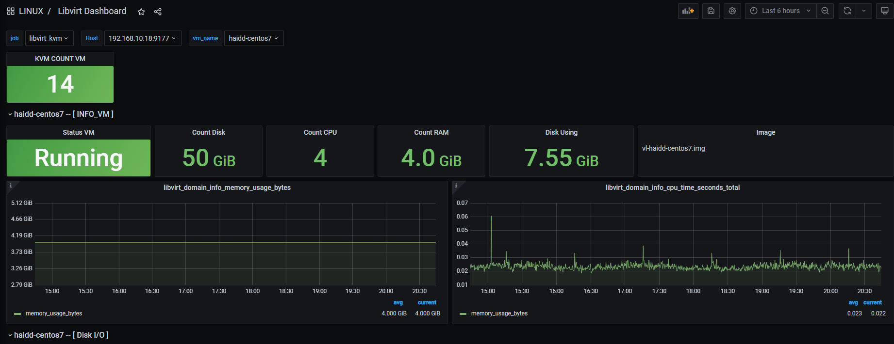
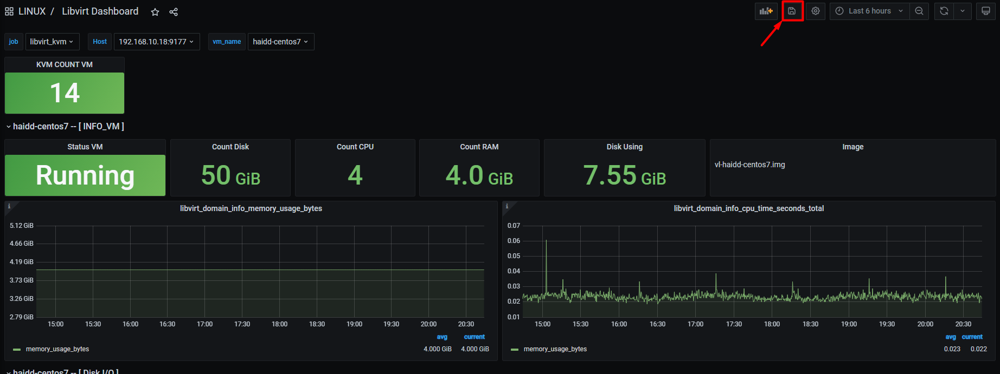

# Import dashboard cho Libvirt Exporter

Hướng dẫn này mình sử dụng template có sẵn của grafana để hiển thị lên dashboard monitor libvirt kvm.

Để bắt đầu, trước tiên bạn phải down file json template cho dashboard [tại đây](./Exporter_Dashboard_Json/libvirt_kvm_dashboard.json)

Sau khi tải về file json, tiến hành truy cập grafana.

- Tại giao diện `Home` của grafana, chọn `+` sau đó chọn `import` để tải lên file json.

- Chọn `Upload JSON file` để tải lên file json

- Chọn file json mới tải xuống ở bước trước để up lên và chọn `Import` để nhập

- Sau khi import, dashboard có thể hiển thị dữ liệu monitor libvirt như này là đã thành công. 

- Chọn `Save` để lưu lại dashboard

