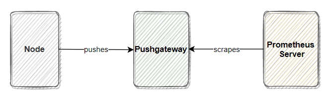
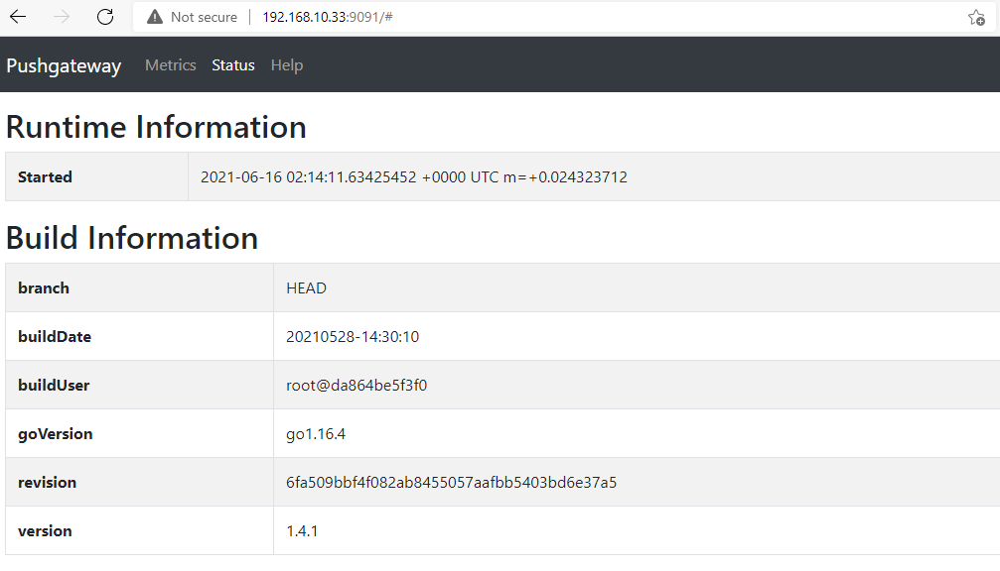
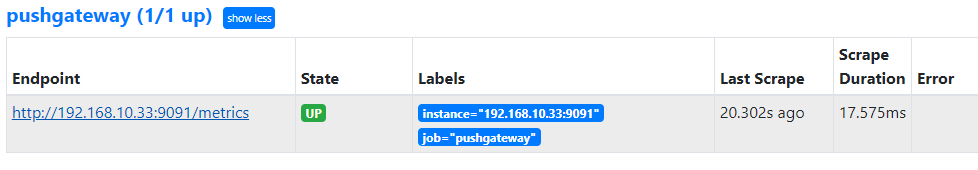
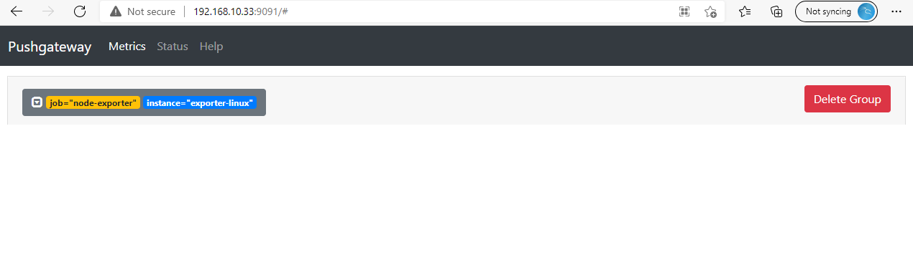
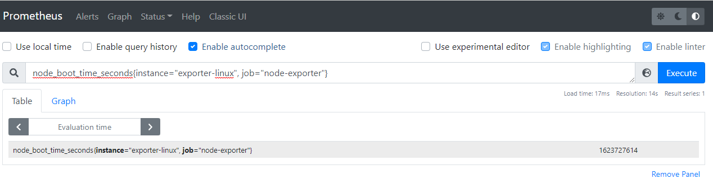

# Pushgateway

Trong prometheus, khi ta sử dụng pull tức là trên các node cần giám sát ta sẽ cài exporter để thu thập các metric rồi phơi lên web. Prometheus sẽ truy cập vào web đó để pull các metric về. Nhưng nếu bạn có những công việc ngắn hạn, tạm thời thì có thể đẩy metric tới pushgateway. Pushgateway không bao giờ xóa các chuỗi được đẩy đến nó và sẽ hiển thị chúng mãi mãi trừ khi ta xóa nó theo cách thủ công.

Khi giám sát nhiều instance thông qua một Pushgateway duy nhất, nó sẽ trở thành một điểm thất bại duy nhất và có thể nghẽn dữ liệu nếu quá nhiều metric cùng đẩy về 1 điểm.

Các lable trong pushgateway mặc định sẽ là `job="pushgateway"` và `instance` mặc đinh sẽ là ip:port của pushgateway.

Khi push metric lên pushgateway, ta nên đặt các lable cho metric.

Để đặt lable, hãy áp dụng tương tự theo cấu trúc sau:

```
/metrics/job/<job_value>/<instance>/<instance_value>/<lable_name>/<lable_value>
```

- `lable name` và `lable value` là tên nhãn và giá trị của nhãn tiếp theo.

# Cài đặt pushgateway trên ubuntu 

## Mô hình triển khai

- Mô hình:



- **Node**:  
*IP: 192.168.10.18*  
*OS: CentOS 7*

- **Pushgateway**:  
*IP: 192.168.10.33*  
*OS: ubuntu*  

- **Node3**:  
*IP: 192.168.10.43**  
**OS: CentOS 7*  

*Chọn 1 trong 2 cách (cài đặt từ docker hoặc cài đặt từ mã nhị phân) để bắt đầu*

## Sử dụng docker để cài đặt (Cách 1)

*Thực hiện trên pushgateway*

- Download docker

```
apt update -y
apt install -y docker.io
```

- Pull image pushgateway và khởi chạy container

```
docker pull prom/pushgateway
```
```
docker run -d \
--name pushgateway \
-p9091:9091 \
--restart always \
prom/pushgateway:latest
```

- Kiểm tra lại service

```
[root@exporter-linux]# docker container ls -a
CONTAINER ID   IMAGE                                     COMMAND                  CREATED       STATUS       PORTS                                       NAMES
f5a86fec70dc   prom/pushgateway                          "/bin/pushgateway"       2 hours ago   Up 2 hours   0.0.0.0:9091->9091/tcp, :::9091->9091/tcp   pushgateway
3dbcf3a33a43   quay.io/prometheus/node-exporter:latest   "/bin/node_exporter …"   8 days ago    Up 2 hours                                               exporter_system
```

- Truy cập url `http://192.168.10.33:9091 để kiểm tra



## Cài đặt từ mã nhị phân (Cách 2)

*Thực hiện trên pushgateway*

Lựa chọn phiên bản Pushgateway mới nhất cho linux amd64 [tại đây](https://github.com/prometheus/pushgateway/releases)

- Download gói cần thiết:

```
apt install -y wget
```

- Tiến hành tải về và giải nén pushgateway

```
cd /opt
wget https://github.com/prometheus/pushgateway/releases/download/v1.4.1/pushgateway-1.4.1.linux-amd64.tar.gz
tar -xvf pushgateway-1.4.1.linux-amd64.tar.gz
```

- Tạo user cho service pushgateway

```
useradd --no-create-home --shell /bin/false pushgateway
```

- Di chuyển file thực thi và cấp quyền cho user pushgateway

```
cp /opt/pushgateway-1.4.1.linux-amd64/pushgateway /usr/local/bin/pushgateway
chown pushgateway:pushgateway /usr/local/bin/pushgateway
```

- Tạo service để pushgateway chạy như 1 dịch vụ

```
[Unit]
Description=Pushgateway
Wants=network-online.target
After=network-online.target

[Service]
User=pushgateway
Group=pushgateway
Type=simple
ExecStart=/usr/local/bin/pushgateway

[Install]
WantedBy=multi-user.target
```

- Khởi động dịch vụ pushgateway

```
systemctl daemon-reload
systemctl restart pushgateway
systemctl status pushgateway
```

- Truy cập url `http://192.168.10.33:9091 để kiểm tra


# Cấu hình trên prometheus 

*Thực hiện trên prometheus server*

Sau khi cài đặt pushgateway, ta sẽ cấu hình trong prometheus để nó truy cập và lấy metric từ pushgateway. Cấu hình lấy metric từ pushgateway sẽ cấu hình như các job thông thường nhưng ta nên đặt `honor_labels: true` trong file cấu hình.

- Thêm job sau vào cấu hình `scrape_configs` trong file `prometheus.yml`:

```
  - job_name: 'pushgateway'
    honor_labels: true
    static_configs:
      - targets: ['192.168.10.33:9091']
```

- Khởi động lại prometheus

- Kiểm tra target trên prometheus thấy job đã up



# Cấu hình push metric lên pushgateway

*Thực hiện trên node*

Giả sử mình đang chạy node exporter trên `node` và phơi lên web port `9100`. Mình sẽ thử đẩy tất cả các metric của node exporter lên pushgateway và prometheus sẽ thu thập các metric của `node` từ `pushgateway`

>**Lưu ý:** Trong thực tế ta sẽ không làm như vậy và prometheus vẫn truy cập vào node exporter để lấy các metric như bình thường chứ không thông qua pushgateway. Mục đích bài lab này chỉ để ta biết cách cấu hình pushgateway và luồng hoạt động của nó.

- Tạo 1 file bash để thực thi lệnh push. Mình sẽ tạo 1 file có tên `push_node_exporter_metrics.sh` và ghi vào file nội dung như sau:

```
#!/bin/bash
PUSHGATEWAY_SERVER=http://192.168.10.33:9091
NODE_NAME=$HOSTNAME
curl -s 192.168.10.18:9100/metrics | curl --data-binary @- $PUSHGATEWAY_SERVER/metrics/job/node-exporter/instance/$NODE_NAME
```
> - `PUSHGATEWAY_SERVER` ta khai báo url của pushgateway
> - `NODE_NAME` sẽ lấy ra host name của máy dựa vào biến môi trường `HOSTNAME`
> - `curl -s 192.168.10.18:9100/metrics` lấy các metric của node_exporter và `curl --data-binary @- $PUSHGATEWAY_SERVER/metrics/job/node-exporter/instance/$NODE_NAME` push các metric đó lên `pushgateway`.

- Cấp quyền cho file:

```
chmod +x push_node_exporter_metrics.sh
```

- Chạy file để lấy metric và push lên `pushgateway`

```
./push_node_exporter_metrics.sh
```

>Khi chạy thực tế nên đưa vào cron tab để đặt lịch push theo khoảng thời gian mong muốn. 

- Truy cập  Pushgateway để kiểm tra:



Ta đã thấy metric được lưu trên pushgateway tại tab `Metrics`. 

- Truy cập web interface của prometheus để kiểm tra:

Thử query 1 metric với 2 label `instance="exporter-linux"` và `job="node-exporter"`.

```
node_boot_time_seconds{instance="exporter-linux", job="node-exporter"}
```



Như vậy prometheus đã thu thập được metric của node exporter thông qua pushgateway. Tuy nhiên nếu máy chạy `node_exporter` chết nó sẽ không thể gửi được các metric lên pushgateway và pushgateway vẫn sẽ lưu metric được push mới nhất và không đảm bảo realtime trạng thái máy chủ. Nên pushgateway chỉ nên sử dụng cho những job ngắn hạn.


**Tài liệu tham khảo**

https://prometheus.io/docs/practices/pushing/

https://github.com/hocchudong/ghichep-prometheus-v2/blob/master/docs/Pushgateway.md

https://www.metricfire.com/blog/prometheus-pushgateways-everything-you-need-to-know/