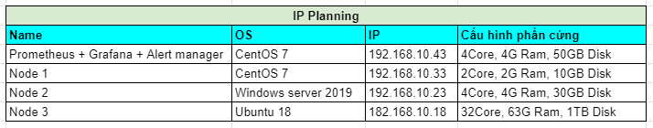

# Alertting

Alert rule hoạt động trên prometheus với 2 thành phần:

- `Alerting rules`
- `Alertmanager`

Các bước tiến hành để thiết lập cảnh báo:

- Cài đặt và cấu hình Alertmanager
- Cấu hình prometheus liên kết với Alertmanager
- Tạo các fule alert trong Prometheus


## Alert manager

Alert manager xử lý cảnh báo được gửi bởi prometheus server. nó có các cơ chế `grouping`, `inhibition`, `silience` và gửi thông báo qua các phương thức như email, các nền tảng chat trực tuyến, ...

- **Grouping** : Phân loại cảnh báo có những tính chất tương tự. Điều này thực sự hữu ích trong một hệ thống lớn với nhiều thông báo được gửi đông thời.

Ví dụ: một hệ thống với nhiều server mất kết nối đến cơ sở dữ liệu, thay vì rất nhiều cảnh báo được gửi về Alertmanager thì Grouping giúp cho việc giảm số lượng cảnh báo trùng lặp, thay vào đó là một cảnh báo để chúng ta có thể biết được chuyện gì đang xảy ra với hệ thống của bạn.

- **Inhibition** : Inhibition là một khái niệm về việc chặn thông báo cho một số cảnh báo nhất định nếu các cảnh báo khác đã được kích hoạt.

Ví dụ: Một cảnh báo đang kích hoạt, thông báo là cluster không thể truy cập (not reachable). Alertmanager có thể được cấu hình là tắt các cảnh báo khác liên quan đến cluster này nếu cảnh báo đó đang kích hoạt. Điều này lọc bớt những cảnh báo không liên quan đến vấn đề hiện tại.

- **Silience** : Silience là tắt cảnh báo trong một thời gian nhất định. Nó được cấu hình dựa trên các match, nếu nó match với các điều kiện thì sẽ không có cảnh báo nào được gửi khi đó.

- **High avability** : Alertmanager hỗ trợ cấu hình để tạo một cluster với độ khả dụng cao.

# Cài đặt Alert manager

## 1. Mô hình 

### Mô hình triển khai 


### IP planning 



## 2. Thiết lập môi trường

### 2.1. Cài đặt và thiết lập môi trường hệ thống

- Update hệ thống

```
yum update -y
```
 
- Tắt firewall và selinux

```
systemctl  disable firewalld --now
```

```
sed -i 's/SELINUX=enforcing/SELINUX=disabled/g' /etc/sysconfig/selinux
sed -i 's/SELINUX=enforcing/SELINUX=disabled/g' /etc/selinux/config
setenforce 0
```

- Đồng bộ thời gian với NTP server

Kiểm tra thời gian hệ thống, nếu thời gian sai hãy đặt lại thời gian hoặc đồng bộ thời gian với NTP server.

Cú pháp đặt lại thời gian trên linux:

```
date -s "09 JUN 2021 08:52:00"
```

Kiểm tra thời gian:

```
[root@exporter-linux ~]# date
Wed Jun  9 08:53:17 +07 2021
```

### 2.2. Cài đặt prometheus

Ở phần trước mình đã cài đặt prometheus, xem cách cài đặt và cấu hình của mình [tại đây](./2._Install_Prometheus_vs_Grafana.md)


## 3. Cài đặt Alert Manager sử dụng docker

### 3.1. Cài đặt docker 

- Tải về docker 

```
yum install -y yum-utils
```

```
yum-config-manager \
    --add-repo \
    https://download.docker.com/linux/centos/docker-ce.repo
```

```
yum install docker-ce docker-ce-cli containerd.io -y
```

-  Khởi động docker

```
systemctl start docker
systemctl enable docker
systemctl status docker
```

### 3.2. Cài đặt Alert manager sử dụng docker

- Chạy lệnh sau để run alert manager

```
docker run -d --name alertmanager \
-p9093:9093 \
--mount source=alert_config,target=/etc/alertmanager \
--restart always \
quay.io/prometheus/alertmanager
```

- Kiểm tra container mới tạo

```
[root@prometheus_srv ~]# docker container ls -f "name=alertmanager"
CONTAINER ID   IMAGE                             COMMAND                  CREATED        STATUS         PORTS                                       NAMES
af23c719dfb8   quay.io/prometheus/alertmanager   "/bin/alertmanager -…"   12 hours ago   Up 8 minutes   0.0.0.0:9093->9093/tcp, :::9093->9093/tcp   alertmanager
```

- Truy cập trình duyệt với url `http://192.168.10.43:9093/#/status` để kiểm tra


### 3.3. Cài đặt webhook telegram để gửi cảnh báo về telegram

- Cài đặt telegram webhook

```
docker run --restart=always -d --name telegram-bot \
  -e "bottoken=936053035:AAGbl5y7463f0BCCx4RjzpB3_eRhUUNfKKw" \
  -e "chatid=638927511" \
  -e "username=hungnv" \
  -e "password=123456" \
  -p 9119:9119 longsube/alertmanager-webhook-telegram:1.0
```

> - `bottoken` là token của bot sẽ nhận và gửi cảnh báo
> - `chatid` là id chat của user hoặc group sẽ nhận cảnh báo
> `username` và `password` sử dụng để đặt basic authen cho webhook.

- Kiểm tra container mới tạo 

```
[root@prometheus_srv ~]# docker container ls -f "name=telegram-bot"
CONTAINER ID   IMAGE                                        COMMAND      CREATED       STATUS       PORTS                                       NAMES
cf4c958fa7e4   longsube/alertmanager-webhook-telegram:1.0   "./run.sh"   2 hours ago   Up 2 hours   0.0.0.0:9119->9119/tcp, :::9119->9119/tcp   telegram-bot
```

### 3.4. Cấu hình cảnh báo email và telegram cho alert manager

- Cấu hình file config của alert manager tại `/var/lib/docker/volumes/alert_config/_data/alertmanager.yml`:

```
global:
  resolve_timeout: 1m
templates:
- '/etc/alertmanager/*.tmpl'
route:
  group_by: ['alertname', 'priority']
  group_wait: 3s
  group_interval: 5s
#  repeat_interval: 1m
  receiver: 'notifications-down'
receivers:
- name: notifications-down
  email_configs:
  - to: 'hntbvn108@gmail.com'
    send_resolved: true
    from: 'vn.alert.notify@gmail.com'
    require_tls: true
    smarthost: 'smtp.gmail.com:587'
    auth_username: 'vn.alert.notify@gmail.com'
    auth_password: 'Viethung1999'
    auth_secret: 'vn.alert.notify@gmail.com'
    auth_identity: 'vn.alert.notify@gmail.com'
  webhook_configs:
  - url: 'http://192.168.10.43:9119/alert'
    send_resolved: true
    http_config:
      basic_auth:
        username: 'hungnv'
        password: '123456'
```

> - Thay `receiver@gmail.com` bằng địa chỉ email của người nhận cảnh báo
> - `sender@gmail.com` là địa chỉ email của người gửi cảnh báo
> - `sender_password` là mật khẩu của email gửi cảnh báo
> - URL `http://192.168.10.43:9119/alert` là địa chỉ của webhook telegram
> - `basic_auth` để cấu hình user và pass authen của webhook telegram đã tạo trước đó.

- Thiết lập tắt xác minh 2 bước và bật quyền truy cập cho ứng dụng kém an toàn của email [tại đây](https://myaccount.google.com/u/1/security?gar=1)

- Tải về template cho cảnh báo

```
cd /var/lib/docker/volumes/alert_config/_data
wget https://raw.githubusercontent.com/prometheus/alertmanager/master/template/default.tmpl
```

- Reload config cho alert manager

```
docker exec -it -u 0 alertmanager killall -HUP alertmanager
```

## 4.Cấu hình prometheus trỏ về alert manager

Truy cập file `prometheus.yml`. Với docker đường dẫn của nó sẽ đặt tại `/var/lib/docker/volumes/prometheus_config/_data/prometheus.yml`. Sau khi truy cập file ta chỉnh sửa `alerting` như sau:

```
.....

# Alertmanager configuration
alerting:
  alertmanagers:
  - static_configs:
    - targets:
      - 192.168.10.43:9093

# Load rules once and periodically evaluate them according to the global 'evaluation_interval'.
rule_files:
  # - "first_rules.yml"
  - "alert_rules.yml"

.....
````

> - Thêm target cho alermanager là địa chỉ IP:PORT của alertmanager
> -  Khai báo rule file là `alert_rules.yml`

Lưu lại file cấu hình. 

- Sau đó ta sẽ tạo 1 rule file

```
touch /var/lib/docker/volumes/prometheus_config/_data/alert_rules.yml
```

- Thêm vào file 1 rule cảnh báo khi có node bị down trong vòng 15s

```
groups:
- name: Instances
  rules:
  - alert: InstanceDown
    expr: up == 0
    for: 15s
    labels:
      severity: page
    # Prometheus templates apply here in the annotation and label fields of the alert.
    annotations:
      description: '{{ $labels.instance }} of job {{ $labels.job }} has been down for more than 15s'
      summary: 'Instance {{ $labels.instance }} down'
```

- Kiểm tra cú pháp trong file rule bằng lệnh sau:

```
docker exec -it -u 0 prometheus promtool check rules /etc/prometheus/alert_rules.yml
```

Ta thấy chỉ có 1 thông báo `SUCCESS` tức là không có lỗi cú pháp trong file rule.

```
[root@prometheus_srv ~]# docker exec -it -u 0 prometheus promtool check rules /etc/prometheus/exporter_rules.yml
Checking /etc/prometheus/exporter_rules.yml
  SUCCESS: 15 rules found
```

- Reload lại cấu hình prometheus

```
docker exec -it -u 0 prometheus killall -HUP prometheus
```

- Thử tắt 1 node exporter và xem cảnh báo có trên gmail và telegram là đã thành công. 

**Cảnh báo trên gmail:**


**Cảnh báo trên telegram:**


**Tài liệu tham khảo**

- https://github.com/nhanhoadocs/prometheus_notes/blob/master/docs/4.alert.md
- https://github.com/VNPT-SmartCloud-System/Tim-hieu-Prometheus/blob/master/docs/alert_alertmanager%2Bprometheus%2Bslack%26email.md
- https://github.com/longsube/alertmanager-webhook-telegram