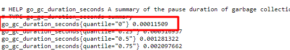
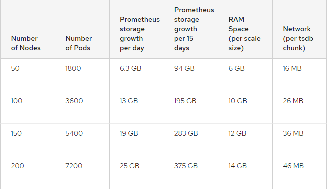

# Storage Prometheus 

## Sử dụng RAM trong prometheus

Prometheus lưu trữ tất cả các mục đang sử dụng trong RAM. Ngoài ra, nó lưu trữ nhiều phần được sử dụng gần đây nhất trong bộ nhớ. Bạn phải cho prometheus biết nó có thể sử dụng bao nhiêu RAM cho bộ nhớ đệm này. 

Cờ `storage.local.target-heap-size` cho phép đặt kich thước mà nó sẽ lưu trữ tối ta trong RAM. Kích thước bộ nhớ RAM vật ký mà Prometheus server sẽ sử dụng là kết quả của các tương tác phức tạp giữa `GO runtime` và OS, rất khó để tính toán chính xác. Nên đặt giá trị `storage.local.target-heap-size` không vượt quá 2/3 kích thước RAM.

Ví dụ giá trị `storage.local.target-heap-size` mặc định là 2G và phù hợp với 3G của RAM vật lý.

Từ prometheus 2.0 không còn sử dụng cờ `storage.local.target-heap-size` để đặt giới hạn sử dụng dung lượng RAM.

## Sử dụng disk

### 1. Storage folder

Prometheus lưu trữ time series database trên disk tại thư mục mặc định là `data`. Cờ `storage.local.retention` cho phép định cấu hình thời gian lưu trữ các metric. 

Cấu trúc các file và thư mục trong `./data` của prometheus. (Sau khi prometheus đã chạy tối thiểu 2h)
```
./data
├── 01BKGV7JBM69T2G1BGBGM6KB12
│   └── meta.json
├── 01BKGTZQ1SYQJTR4PB43C8PD98
│   ├── chunks
│   │   └── 000001
│   ├── tombstones
│   ├── index
│   └── meta.json
├── 01BKGTZQ1HHWHV8FBJXW1Y3W0K
│   └── meta.json
├── 01BKGV7JC0RY8A6MACW02A2PJD
│   ├── chunks
│   │   └── 000001
│   ├── tombstones
│   ├── index
│   └── meta.json
├── chunks_head
│   └── 000001
└── wal
    ├── 000000002
    └── checkpoint.00000001
        └──
 00000000
```

Ban đầu dữ liệu được ghi trong RAM và được bảo vệ khỏi sự cố bằng wal. Các dữ liệu này gọi là các `sample`.
 
> - `Sample` là giá trị duy nhất trong 1 thời điểm trong time series. Trong prometheus, sample bao gồm 1 giá trị float64 và 1 dấu thời gian có độ chính xác đến mili giây. Thông thường, sample sẽ được coi là 1 metric.

- VD về sample: Giá trị float và dấu thời gian của giá trị float đó. 


###  2. On-disk layout

- Các `sample` được nhóm lại với nhau thành 1 hoặc nhiều block trong 2h. Mỗi block bao gồm 1 thư mục chứa tất các các time series samples cho khoảng thời gian đó, 1 file metadata và 1 file index (đánh index tên và label cho time series trong thư mục block).

- Theo mặc định, các `sample` trong thư mục block được nhóm lại với nhau thành 1 hoặc nhiều tệp phân đoạn lên đến 512MB mỗi tệp và lưu trong thư mục (chunks). Khi 1 series được xóa qua API, các bản ghi xóa được lưu trữ trong các tệp `tombstones` (Thay vì xóa dữ liệu ngay lập tức khỏi các tệp phân đoạn `chunks`)

- Các `sample` ban đầu được lưu trong RAM và có thể bị xóa khi có sự cố (tắt máy). Nó được bảo vệ khỏi sự cố bằng nhật ký trước (WAL - write-ahead log) có thể được replayed khi máy chủ prometheus khởi động lại. Các tệp này là dữ liệu ở dạng raw data chưa được nén nên kích thước của nó có thể sẽ lớn. Prometheus sẽ giữ tối thiểu 3 file trong WAL. Sau khoảng 2 giờ, dữ liệu trong `WAL` được nén và nó sẽ tạo các thư mục để lưu dữ liệu này. Ví dụ về tên thư mục `01F7R6VS20HJK9QQ8D3K5RG8TQ`

- Đối với những lần tắt máy bất thường, máy chủ prometheus có thể mất dữ liệu và bộ nhớ có thể ở trạng thái không nhất quán. Prometheus khi khởi động sẽ thực hiện khôi phục sự cố. Thông tin về quá trình khôi phục sự cố sẽ được ghi lại, vì vậy bạn có thể sử dụng nó cho công việc forensic nếu cần. Dữ liệu không thể khôi phục được chuyển đến 1 thư mục có tên `orphaned` nằm ở `./data`. Hãy xóa dữ liệu đó nếu không cần nữa.

- Dữ liệu trong prometheus được lưu trữ mặc định trong khoảng 15 ngày.

### 2. Sizing

#### 2.1. Các flags

Prometheus có các cờ sử dụng để định cấu hình lưu trữ cục bộ. Một số cờ quan trọng như:

- `--storage.tsdb.path`: Nơi Prometheus đặt dữ liệu của nó. Mặc định là data/.

- `--storage.tsdb.retention.time`: Khi nào thì xóa dữ liệu cũ. Mặc định là 15d. Nếu đặt thành 1 số khác với mặc đinh `storage.tsdb.retention`, nó sẽ ghi đè lên tham số này. 

- `--storage.tsdb.wal-compression`: Cho phép nén nhật ký ghi trước (WAL). Khi tính năng này được bật, kích thước lưu trữ sẽ chỉ bằng 1 nửa kích thước lưu trong WAL. Cờ này được giới thiệu trong 2.11.0 và được kích hoạt theo mặc định trong 2.20.0

#### 2.2. Sizing

Prometheus lưu trữ trung bình chỉ 1-2 byte cho mỗi `sample`. Do đó, để lập kế hoạch công suất của máy chủ Prometheus, bạn có thể sử dụng công thức sau:

```
Dung lượng disk cần = retention_time_seconds * ingested_samples_per_second * bytes_per_sample
```

> - `retention_time_seconds`: Thời gian lưu trữ dự kiến tính bằng giây
> - `ingested_samples_per_second`: Số lượng sample được lưu trữ mỗi giây ( từ số lượng sample lấy được trong 1 lần scrape và khoảng thời gian tiến hành scrape có thể tính được trong 1s sẽ có bao nhiêu sample được lưu trữ)
> - `bytes_per_sample`: Dung lượng byte của mỗi sample. `bytes_per_sample` vào khoảng từ 1.3 - 3.3, giá trị thực tế thông thường là 2.

VD:

Thu thập metric trong 2h, mỗi 5s scrape 1 lần và có khoảng 510 metric.

- Thời gian lưu trữ tính bằng s:

=> `retention_time_seconds` = `2 × 60 × 60` = 7200 (s)  

- Số lượng sample được lưu trữ mỗi s được tính bằng số lượng metric mỗi s chia cho thời gian tiến hành scrape:  

=> `ingested_samples_per_second` = `510 ÷ 5` = 102 (sample)

- Để đảm bảo dung lượng disk luôn có sẵn để lưu trữ, nên đặt `bytes_per_sample` ở vào khoảng 4-6. Hoặc có thể tính theo số byte là 3,3 và thêm khoảng 20% kích thước dự kiến để đảm bảo dung lượng lưu trữ luôn sẵn sàng.

- Ta sẽ tính dung lượng lưu trữ trong 2h như sau:

```
Dung lượng disk cần = 7200 × 102 × 3,3 = 1.468.800 byte = 2,3 MB
```

=> Để đảm bảo dung lượng disk lưu trữ có sẵn, ta nên thêm 20% dung lượng disk lưu trữ dự kiến nữa:

2,3 + [ (2,3 ÷ 100) × 20 ] = 2,76 MB

=> Dung lượng disk nên có để lưu trữ trong 2h, mỗi 5s scrape 1 lần với khoảng 510 metric là: 2,76 MB.

- Các thử nghiệm của redhat cho quy mô cụm prometheus:



- [TSDB format](https://github.com/prometheus/prometheus/blob/release-2.27/tsdb/docs/format/README.md)


