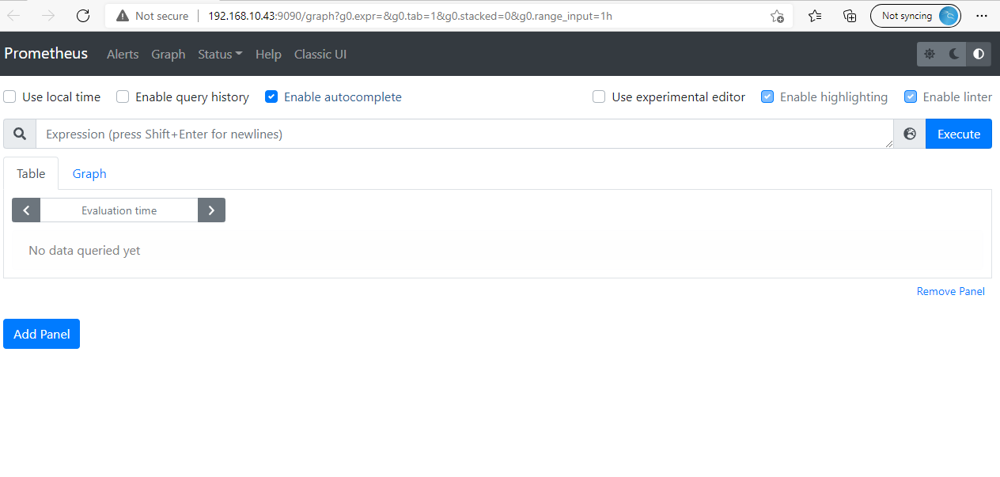
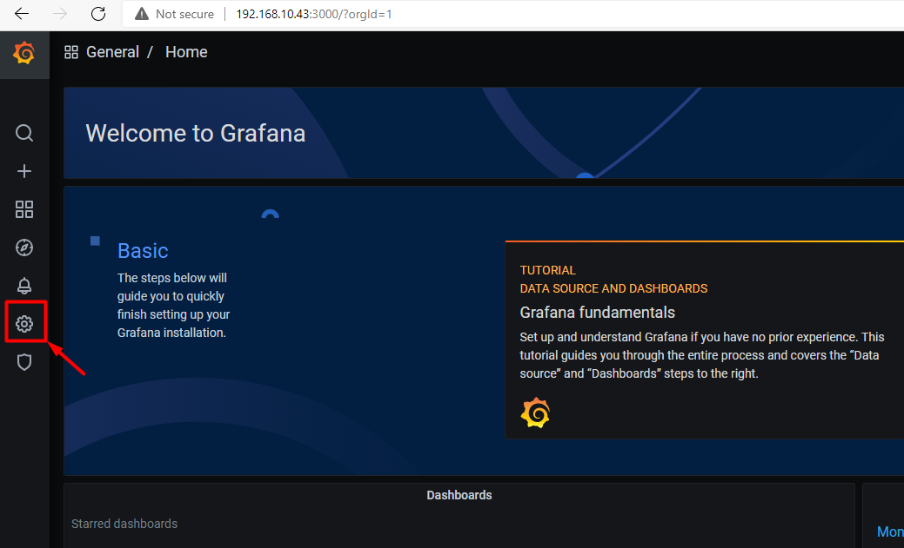
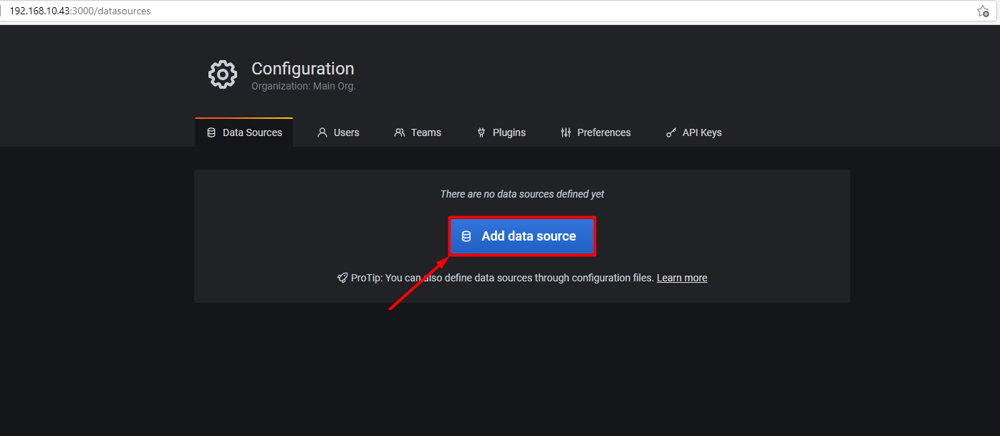
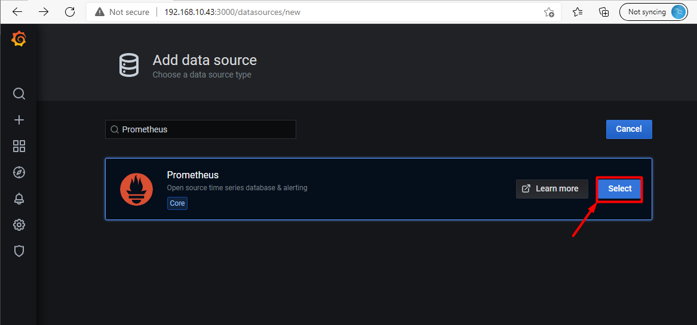
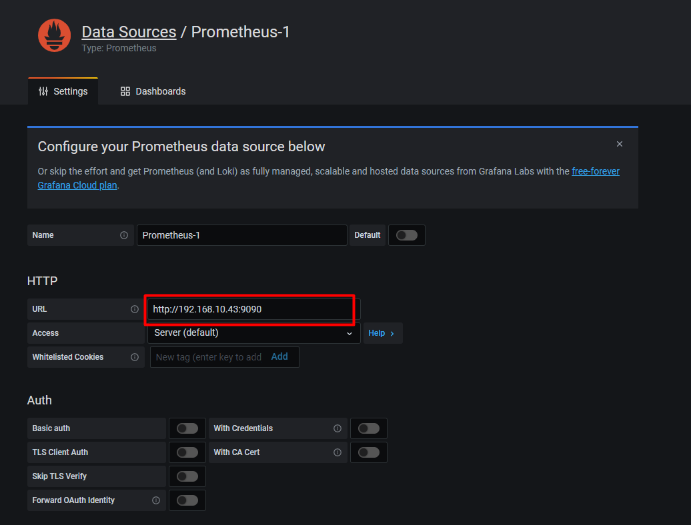
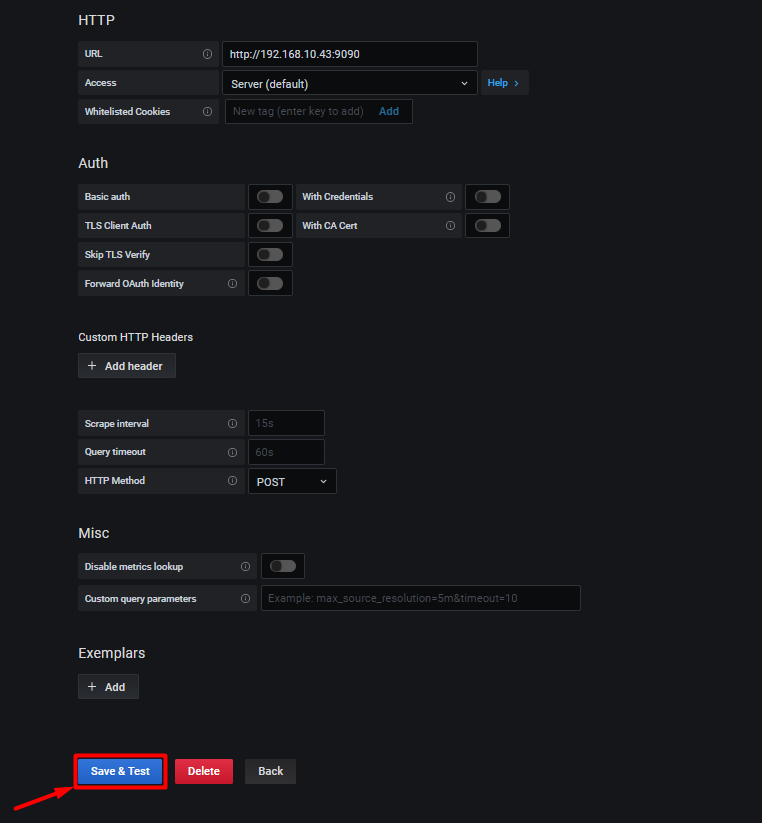
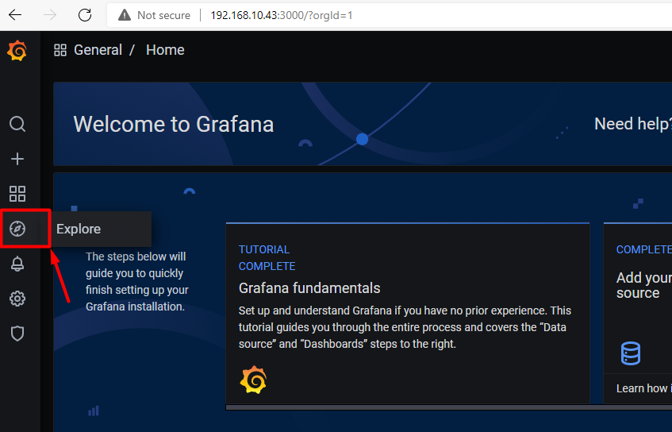
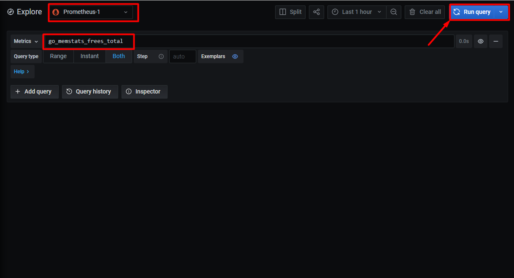
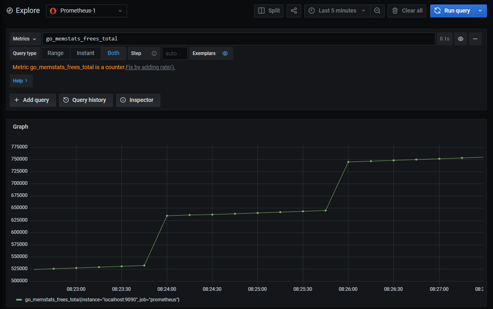

# Cài đặt Prometheus vs Grafana

## 1. Mô hình 

### Mô hình triển khai 


### IP planning 


## 2. Thiết lập môi trường

- Update hệ thống

```
yum update -y
```
 
- Tắt firewall và selinux

```
systemctl  disable firewalld --now
```

```
sed -i 's/SELINUX=enforcing/SELINUX=disabled/g' /etc/sysconfig/selinux
sed -i 's/SELINUX=enforcing/SELINUX=disabled/g' /etc/selinux/config
setenforce 0
```

- Đồng bộ thời gian với NTP server

Kiểm tra thời gian hệ thống, nếu thời gian sai hãy đặt lại thời gian hoặc đồng bộ thời gian với NTP server.

Cú pháp đặt lại thời gian trên linux:

```
date -s "09 JUN 2021 08:52:00"
```

Kiểm tra thời gian:

```
[root@exporter-linux ~]# date
Wed Jun  9 08:53:17 +07 2021
```

## 3. Cài đặt

*Chọn 1 trong 2 cách cài (cài thông thường hoặc sử dụng docker) để tiến hành*

### 3.1. Cài đặt Prometheus và Grafana sử dụng docker (Cách 1)

#### 3.1.1. Cài đặt docker 

- Tải về docker 

```
yum install -y yum-utils
```

```
yum-config-manager \
    --add-repo \
    https://download.docker.com/linux/centos/docker-ce.repo
```

```
yum install docker-ce docker-ce-cli containerd.io -y
```

-  Khởi động docker

```
systemctl start docker
systemctl enable docker
systemctl status docker
```

#### 3.1.2. Cài đặt Prometheus

- Chạy lệnh sau để run container prometheus

```
docker run -d --name prometheus \
--net=host \
--restart always \
--mount source=prometheus_config,target=/etc/prometheus \
prom/prometheus \
--config.file=/etc/prometheus/prometheus.yml --storage.tsdb.retention.time=10d
```

> `storage.tsdb.retention.time` đặt khoảng thời gian để xóa dữ liệu cũ, nếu không đặt thì mặc định là 15d, set số ngày lớn hơn nếu bạn muốn lưu lại dữ liệu lâu hơn.

- Kiểm tra container mới tạo:

```
[root@prometheus_srv ~]# docker container ls
CONTAINER ID   IMAGE             COMMAND                  CREATED        STATUS          PORTS     NAMES
6d8eca2e2fee   prom/prometheus   "/bin/prometheus --c…"   12 hours ago   Up 22 seconds             prometheus
```

- Với cách này file cấu hình của prometheus được đặt tại:

```
/var/lib/docker/volumes/prometheus_config/_data
```

- Truy cập trình duyệt với url `http://192.168.10.43:9090/` để kiểm tra:



#### 3.1.3. Cài đặt Grafana

- Chạy lệnh sau để run container grafana

```
docker run -d --name grafana \
-p 3000:3000 \
--restart always \
grafana/grafana
```

- Kiểm tra container mới tạo:

```
[root@prometheus_srv ~]# docker container ls -a
CONTAINER ID   IMAGE             COMMAND                  CREATED        STATUS         PORTS                                       NAMES
32679773b5ce   grafana/grafana   "/run.sh"                12 hours ago   Up 4 seconds   0.0.0.0:3000->3000/tcp, :::3000->3000/tcp   grafana
6d8eca2e2fee   prom/prometheus   "/bin/prometheus --c…"   12 hours ago   Up 4 minutes                                               prometheus
```

- Truy cập web để kiểm tra
 
Truy cập `http://192.168.10.43:3000/` để kiểm tra grafana với user và pass mặc định là `admin`


### 3.2. Cài đặt Prometheus và Grafana từ nguồn (Cách 2)

- Cài đặt gói cần thiết

```
yum install wget -y
```

#### 3.2.1. Cài đặt Prometheus

- Tạo user cho prometheus

```
useradd --no-create-home --shell /bin/false prometheus
```

- Tạo và phân quyền các thư mục chính cho prometheus

```
mkdir /etc/prometheus
mkdir /var/lib/prometheus
chown prometheus:prometheus /etc/prometheus
chown prometheus:prometheus /var/lib/prometheus
```

- Tải source code prometheus

```
cd /opt
wget https://github.com/prometheus/prometheus/releases/download/v2.27.1/prometheus-2.27.1.linux-amd64.tar.gz -O prometheus.tar.gz
tar xvf prometheus.tar.gz 
mv prometheus-2.27.1.linux-amd64 prometheus
```

- Copy và phân quyền cho các thư mục cấu hình

```
cp prometheus/prometheus /usr/local/bin/
cp prometheus/promtool /usr/local/bin/

chown prometheus:prometheus /usr/local/bin/prometheus
chown prometheus:prometheus /usr/local/bin/promtool

cp -r prometheus/consoles /etc/prometheus
cp -r prometheus/console_libraries /etc/prometheus

chown -R prometheus:prometheus /etc/prometheus/consoles
chown -R prometheus:prometheus /etc/prometheus/console_libraries
```

- Cấu hình config prometheus tự scrape metric của mình

```
cat <<EOF > /etc/prometheus/prometheus.yml
global:
  scrape_interval: 15s

scrape_configs:
  - job_name: 'prometheus'
    scrape_interval: 5s
    static_configs:
      - targets: ['localhost:9090']
EOF
```

- Tạo service cho prometheus server

```
cat <<EOF > /etc/systemd/system/prometheus.service
[Unit]
Description=Prometheus
Wants=network-online.target
After=network-online.target

[Service]
User=prometheus
Group=prometheus
Type=simple
ExecStart=/usr/local/bin/prometheus \
    --config.file /etc/prometheus/prometheus.yml \
    --storage.tsdb.path /var/lib/prometheus/ \
    --web.console.templates=/etc/prometheus/consoles \
    --web.console.libraries=/etc/prometheus/console_libraries
    --storage.tsdb.retention.time=10d

[Install]
WantedBy=multi-user.target
EOF
```

- Khởi động Prometheus

```
systemctl daemon-reload
systemctl start prometheus
systemctl status prometheus
systemctl enable prometheus
```

- Với cách này, file cấu hình của prometheus được đặt tại:

```
/etc/prometheus
```

- Truy cập trình duyệt với url `http://192.168.10.43:9090/` để kiểm tra:


#### 3.2.2. Cài đặt Grafana

- Add repo grafana

```
tee  /etc/yum.repos.d/grafana.repo<<EOF
[grafana]
name=grafana
baseurl=https://packages.grafana.com/oss/rpm
repo_gpgcheck=1
enabled=1
gpgcheck=1
gpgkey=https://packages.grafana.com/gpg.key
sslverify=1
sslcacert=/etc/pki/tls/certs/ca-bundle.crt
EOF
```

- Cài đặt grafana

```
yum  -y install grafana
```

- Khởi động grafana

```
systemctl enable --now grafana-server
```

- Truy cập trình duyệt để kiểm tra
 
Truy cập `http://192.168.10.43:3000/` để kiểm tra grafana với user và pass mặc định là `admin`


## 4. Kết nối Prometheus với grafana

### 1. Cấu hình

Tại giao diện của grafana chọn setting 



Tiếp theo chọn `Add data source` để add Prometheus:



Sau đó tìm `Prometheus` và chọn `Select` để add.



Tại mục cấu hình url của HTTP nhập url của prometheus:



Chọn `Save & Test` để lưu lại.



### 2. Kiểm tra

Chọn `Explore` để xem dữ liệu trực tiếp



Chọn nguồn dữ liệu mới tạo của prometheus có tên là `Prometheus-1`, nhập 1 metric bất kỳ (mình sử dụng `go_memstats_frees_total`)  và chọn `Run query` để kiểm tra. 



Sau khi run ta thấy dữ liệu đã có thên biểu đồ thì đã thành công.



## Tài liệu tham khảo

https://github.com/prometheus/node_exporter

https://hocchudong.com/huong-dan-cau-hinh-prometheus-thu-thap-metric-tren-centos7-phan-2/


