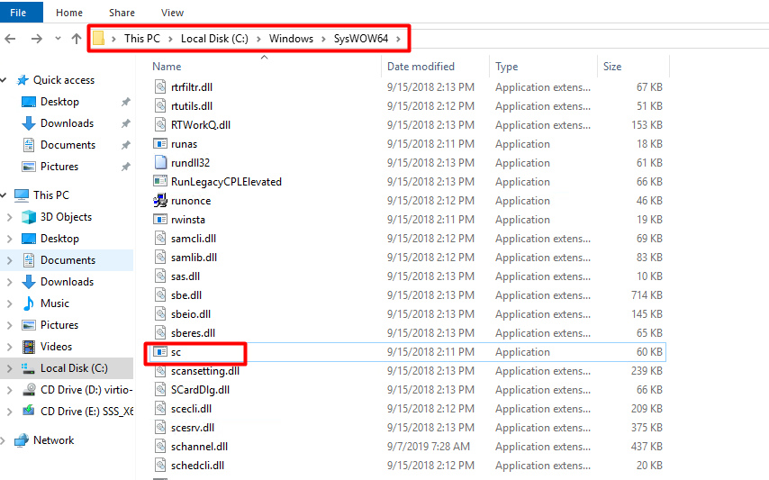

# Cài đặt Node Exporter trên Windows

## 1. Mô hình 

### Mô hình triển khai 


### IP planning 


## 2. Cài đặt Node Exporter cho Windows

*Thực hiện trên Node 2*

- Tải về window node exporter [Tại đây](https://github.com/prometheus-community/windows_exporter/releases/download/v0.16.0/windows_exporter-0.16.0-amd64.exe)

Sau khi tải xuống, hãy xác định đường dẫn đang lưu file. Sau khi tải xuống, file của mình được lưu tại: `C:\Users\Administrator\Downloads\`

Tiến hành chạy file ta sẽ được như sau:


Exporter chạy thành công, nếu thoát cửa sổ CMD, exporter sẽ ngừng hoạt động nên ta sẽ tạo service tên là `ExporterService` và chạy file exe mới tải xuống tên là `windows_exporter-0.16.0-amd64.exe` nằm trong đường dẫn `C:\Users\Administrator\Downloads\`

Để tạo service, ta sử dụng `sc.exe` được lưu tại `C:\Windows\SysWOW64\`



- Mở `CMD` với quyền admin và tiến hành tạo service:

```
cd C:\Windows\SysWOW64\

sc.exe create ExporterService start= auto binpath= "C:\Users\Administrator\Downloads\windows_exporter-0.16.0-amd64.exe"
```

Sau khi tạo thành công sẽ có trạng thái là `CreateService SUCCESS`


- Tiếp theo, truy cập `Computer Management` -> `Service and Applications` -> `Services` để khởi động dịch vụ


- Tìm đến service mới tạo là `ExporterService` , kích chuột phải và chọn `Start`


- Sử dụng trình duyệt truy cập vào url `http://192.168.10.23:9182/metrics` để kiểm tra.


## 3. Cấu hình Exporter trên Prometheus server

*Thực hiện trên Prometheus server*

### 3.1. Thêm cấu hình node exporter vào prometheus server (đối với prometheus cài bằng docker)

- Tiến hành sửa file `/var/lib/docker/volumes/prometheus_config/_data` thêm nội dung sau:

```
- job_name: 'node2'
  scrape_interval: 5s
  static_configs:
    - targets: ['192.168.10.23:9182']
```

Sau khi thêm cấu hình sẽ như sau:

```
global:
alerting:
  alertmanagers:
  - static_configs:
    - targets:
rule_files:
scrape_configs:
  - job_name: 'prometheus'
    static_configs:
    - targets: ['localhost:9090']
  - job_name: 'node1'
    scrape_interval: 5s
    static_configs:
      - targets: ['192.168.10.33:9100']
  - job_name: 'node2'
    scrape_interval: 5s
    static_configs:
      - targets: ['192.168.10.23:9182']
```

- Khởi động lại container chạy prometheus 

```
docker container restart prometheus
```

### 3.2. Thêm cấu hình node exporter vào prometheus server (đối với prometheus cài thông thường)

- Tiến hành sửa file `/etc/prometheus/prometheus.yml` thêm nội dung sau:

```
- job_name: 'node_2'
  scrape_interval: 5s
  static_configs:
    - targets: ['192.168.10.23:9182']
```

Sau khi thêm cấu hình trông như sau:

```
global:
  scrape_interval: 15s

scrape_configs:
  - job_name: 'prometheus'
    scrape_interval: 5s
    static_configs:
      - targets: ['localhost:9090']
  - job_name: 'node1'
    scrape_interval: 5s
    static_configs:
      - targets: ['192.168.10.33:9100']
  - job_name: 'node2'
    scrape_interval: 5s
    static_configs:
      - targets: ['192.168.10.23:9182']
```

- Khởi động lại Prometheus:

```
systemctl restart prometheus
```

## Tài liệu tham khảo

https://hocchudong.com/huong-dan-cau-hinh-prometheus-thu-thap-metric-tren-windows-phan-3/

https://thangletoan.wordpress.com/2014/03/08/cch-tao-cc-ung-dung-chay-trn-nen-windows-service/