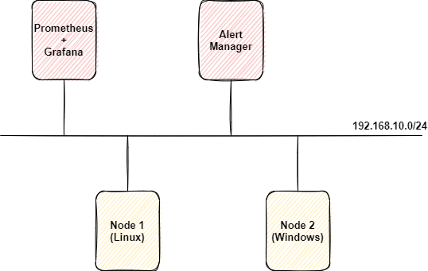
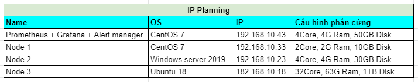
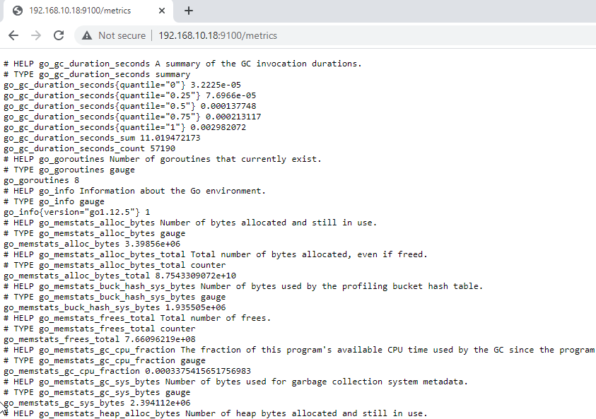

# Cài đặt Node Exporter trên Ubuntu 

## 1. Mô hình 

### Mô hình triển khai 



### IP planning 



## 2. Thiết lập môi trường

- Update hệ thống

```
apt update -y
```
 
- Tắt firewall (nếu firewall được bật thì phải tiến hành mở port 9100)

```
systemctl  disable ufw --now
```

- Đồng bộ thời gian với NTP server

Kiểm tra thời gian hệ thống, nếu thời gian sai hãy đặt lại thời gian hoặc đồng bộ thời gian với NTP server.

Cú pháp đặt lại thời gian trên linux:

```
date -s "09 JUN 2021 08:52:00"
```

Kiểm tra thời gian:

```
[root@kvm ~]# date
Wed Jun  9 08:53:17 +07 2021
```

## 3. Cài đặt Node Exporter

*Chọn 1 trong 2 cách cài (cài thông thường hoặc sử dụng docker) để tiến hành*

### 3.1. Cài đặt với Node Exporter sử dụng docker (Cách 1)

*Thực hiện trên Node 3*

#### 3.1.1. Cài đặt docker 

- Tải về docker 

```
apt install docker.io -y
```

-  Khởi động docker

```
systemctl start docker
systemctl enable docker
systemctl status docker
```

#### 3.1.2. Cài đặt node exporter

- Chạy lệnh sau để run node exporter

```
docker run -d \
--name exporter_system \
--net="host" \
--pid="host" \
--restart always \
-v "/:/host:ro,rslave" \
quay.io/prometheus/node-exporter:latest \
--path.rootfs=/host
```

- Kiểm tra container mới tạo

```
[root@kvm ~]# docker container ls -a
CONTAINER ID   IMAGE                                     COMMAND                  CREATED        STATUS        PORTS     NAMES
418eafb69ab6   quay.io/prometheus/node-exporter:latest   "/bin/node_exporter …"   20 hours ago   Up 20 hours             exporter_system
```

- Truy cập trình duyệt với url `http://192.168.10.18:9100/metrics` để kiểm tra



#### 3.1.3. Cấu hình Exporter trên Prometheus server

*Thực hiện trên Prometheus server*

- Thêm cấu hình node exporter vào prometheus server

Tiến hành sửa file `/var/lib/docker/volumes/prometheus_config/_data` thêm nội dung sau:

```
- job_name: 'node3'
  scrape_interval: 5s
  static_configs:
    - targets: ['192.168.10.18:9100']
```

Sau khi thêm cấu hình sẽ như sau:

```
global:
alerting:
  alertmanagers:
  - static_configs:
    - targets:
rule_files:
scrape_configs:
  - job_name: 'prometheus'
    static_configs:
    - targets: ['localhost:9090']
  - job_name: 'node1'
    scrape_interval: 5s
    static_configs:
      - targets: ['192.168.10.33:9100']
  - job_name: 'node2'
    scrape_interval: 5s
    static_configs:
      - targets: ['192.168.10.23:9182']
  - job_name: 'node3'
    scrape_interval: 5s
    static_configs:
      - targets: ['192.168.10.18:9100']
```

- Khởi động lại container chạy prometheus 

```
docker container restart prometheus
```

### 3.2. Cài Node Exporter từ nguồn (Cách 2)

*Thực hiện trên Node 1*

#### 3.2.1. Cài đặt Node Exporter

-  Cài đặt các gói cần thiết

```
apt install -y wget
```

- Tạo user cho node exporter

```
useradd --no-create-home --shell /bin/false node_exporter
```

- Tải về và giải nén source code

```
cd /opt
wget https://github.com/prometheus/node_exporter/releases/download/v0.18.1/node_exporter-0.18.1.linux-amd64.tar.gz

tar xvf node_exporter-0.18.1.linux-amd64.tar.gz
```

- Di chuyển source code và cấp quyền cho user đã tạo ở trên

```
cp /opt/node_exporter-0.18.1.linux-amd64/node_exporter /usr/local/bin
chown node_exporter:node_exporter /usr/local/bin/node_exporter

rm -rf node_exporter-0.18.1.linux-amd64*
```

- Tạo systemd cho exporter

```
cat <<EOF >  /etc/systemd/system/node_exporter.service
[Unit]
Description=Node Exporter
Wants=network-online.target
After=network-online.target

[Service]
User=node_exporter
Group=node_exporter
Type=simple
ExecStart=/usr/local/bin/node_exporter

[Install]
WantedBy=multi-user.target
EOF
```

- Khởi động dịch vụ `node_exporter`

```
systemctl daemon-reload
systemctl start node_exporter
systemctl enable node_exporter
```

- Truy cập web với địa chỉ url `http://192.168.10.18:9100/metrics`  để kiểm tra các metrics


#### 3.2.2. Cấu hình Exporter trên Prometheus server

*Thực hiện trên Prometheus server*

- Thêm cấu hình node exporter vào prometheus server

Tiến hành sửa file `/etc/prometheus/prometheus.yml` thêm nội dung sau:

```
- job_name: 'node3'
  scrape_interval: 5s
  static_configs:
    - targets: ['192.168.10.18:9100']
```

Sau khi thêm cấu hình trông như sau:

```
global:
  scrape_interval: 15s

scrape_configs:
  - job_name: 'prometheus'
    scrape_interval: 5s
    static_configs:
      - targets: ['localhost:9090']
  - job_name: 'node1'
    scrape_interval: 5s
    static_configs:
      - targets: ['192.168.10.33:9100']
  - job_name: 'node2'
    scrape_interval: 5s
    static_configs:
      - targets: ['192.168.10.23:9182']
  - job_name: 'node3'
    scrape_interval: 5s
    static_configs:
      - targets: ['192.168.10.18:9100']
```

- Khởi động lại Prometheus:

```
systemctl restart prometheus
```

