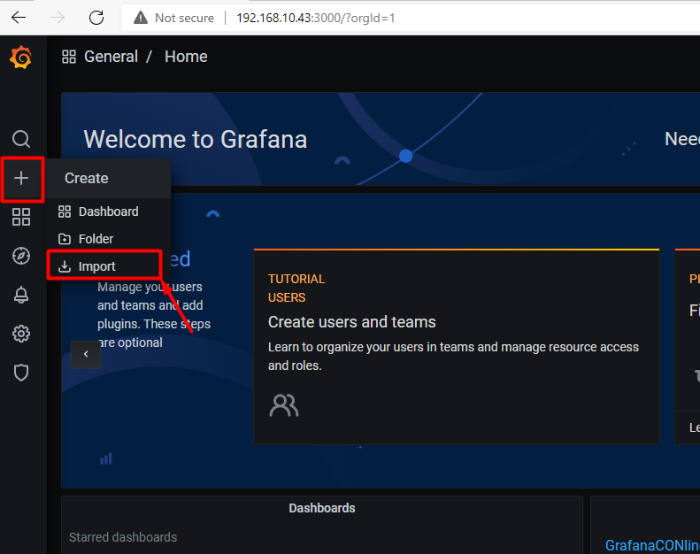

# Import dasboard lên Grafana

## 1. Import dashboard monitor các máy Linux

Hướng dẫn này mình sử dụng template có sẵn của grafana để hiển thị lên dashboard monitor các máy chủ Linux.

Để bắt đầu, trước tiên bạn phải down file json dành cho Linux [tại đây](./Exporter_Dashboard_Json/linux_node_exporter.json) hoặc truy cập vào link sau: https://bom.to/TVajyzjEGmizm

Sau khi tải về file json, tiến hành truy cập grafana. 

- Tại giao diện `Home` của grafana, chọn `+` sau đó chọn `import` để tải lên file json.

- Chọn `Upload JSON file` để tải lên file json

- Chọn file json mới tải xuống ở bước trước, sau đó chọn data source của prometheus:

- Sau khi import, dashboard có thể hiển thị dữ liệu cho các máy Linux như này là đã thành công. 

- Chọn `Save` để lưu lại dashboard

## 2. Import dashboard monitor các máy Windows

Hướng dẫn này mình sử dụng template có sẵn của grafana để hiển thị lên dashboard monitor các máy chủ Windows.

Để bắt đầu, trước tiên bạn phải down file json dành cho Linux [tại đây](./Exporter_Dashboard_Json/windows_node_exporter.json) hoặc truy cập vào link sau: https://bom.to/JmzQfVF2F1TFqd

Sau khi tải về file json, tiến hành truy cập grafana. 

- Tại giao diện `Home` của grafana, chọn `+` sau đó chọn `import` để tải lên file json.

- Chọn `Upload JSON file` để tải lên file json

- Chọn file json mới tải xuống ở bước trước, sau đó chọn data source của prometheus:

- Sau khi import, dashboard có thể hiển thị dữ liệu cho các máy Windows như này là đã thành công. 

- Chọn `Save` để lưu lại dashboard

