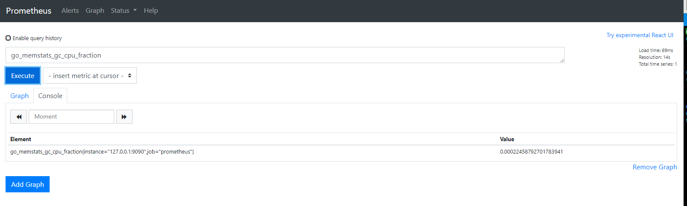

# Hướng dẫn cài đặt Prometheus trên Container

## Mô hình lab:
 - Prometheus: IP 10.159.19.84

### 1. Cài đặt Docker engine trên host
```sh
apt-get update && apt-get -y upgrade && apt-get -y dist-upgrade
apt-get install  apt-transport-https  ca-certificates curl gnupg-agent software-properties-common
curl -fsSL https://download.docker.com/linux/ubuntu/gpg | sudo apt-key add -
sudo add-apt-repository    "deb [arch=amd64] https://download.docker.com/linux/ubuntu \
$(lsb_release -cs) \
stable"
apt-get update
apt-get install docker-ce docker-ce-cli containerd.io -y
```

### 2. Lấy image prometheus bản `latest`
```sh
docker pull prom/prometheus
```

### 3. Tạo file cấu hình `prometheus.yml`
```sh
mkdir prometheus
cd prometheus
vim prometheus.yml
```

#### Nội dung file cấu hình

```sh
# my global config
global:
  scrape_interval:     15s # Set the scrape interval to every 15 seconds. Default is every 1 minute.
  evaluation_interval: 15s # Evaluate rules every 15 seconds. The default is every 1 minute.
  # scrape_timeout is set to the global default (10s).

# Load rules once and periodically evaluate them according to the global 'evaluation_interval'.
rule_files:
  # - "first_rules.yml"
  # - "second_rules.yml"

# A scrape configuration containing exactly one endpoint to scrape:
# Here it's Prometheus itself.
scrape_configs:
  # The job name is added as a label `job=<job_name>` to any timeseries scraped from this config.
  - job_name: 'prometheus'
    # metrics_path defaults to '/metrics'
    # scheme defaults to 'http'.
    static_configs:
    - targets: ['127.0.0.1:9090']
```

### 4. Khởi tạo container Prometheus
```sh
docker run -d --name prometheus -p 9090:9090 \
-v /home/sysadmin/prometheus/prometheus.yml:/etc/prometheus/prometheus.yml \
-v promql:/prometheus \
prom/prometheus --config.file=/etc/prometheus/prometheus.yml
```

Trong đó:
 - `/root/prometheus/prometheus.yml`: là đường dẫn của file cấu hình vừa tạo ở bước trên

### 5. Truy cập vào địa chỉ `10.159.19.84:9090` để vào giao diện của Prometheus


## Tham khảo:

[1] - https://medium.com/aeturnuminc/configure-prometheus-and-grafana-in-dockers-ff2a2b51aa1d